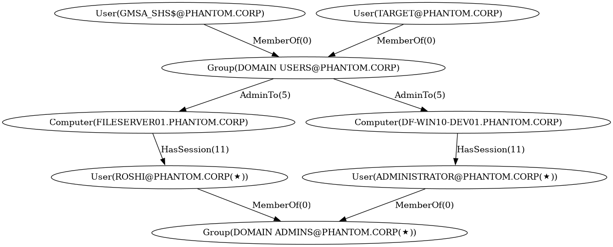

# Pathhound

Simple attack path analyzer for Bloodhound that i developed for CTF machines. It fetches the graph data from the Bloodhound API and converts it into `petgraph`. It supports classic AD, ADCS, Azure/Entra-style nodes and edges, filters non-traversable relationships, and uses A* pathfinding to build reduced attack graphs between chosen source and target nodes.

## Usage

```
Pathhound -- Simple Bloodhound attack path enumerator

Usage: pathhound [OPTIONS]

Options:
  -x, --no-filter                       Tool's default behavior is to filter out "non-traversable" edges. Set this flag to disable the default filtering
  -c, --credentials <CREDENTIALS_PATH>  Path to the Bloodhound credentials file (in JSON format, {"key": ..., "id": ..., "url": <opt>}) [default: ./credentials.json]
  -s, --source-nodes <SOURCE_NODES>     Source nodes (comma-separated, e.g. "A@COMP.COM,S-123-431-1234"; template: ALL-NON-TIER-0)
  -t, --target-nodes <TARGET_NODES>     Target nodes (comma-separated, e.g. "DOMAIN ADMINS@COMP.COM,S-123-431-1234"; templates: DOMAIN-ADMINS,ALL-TIER-0)
  -a, --export-attack-graph             Export subgraph containing only attack-path nodes/edges as JSON without printing the table(s) to standard output
  -h, --help                            Print help
  -V, --version                         Print version
```

You have to create a `credentials.json` file with the following format to be able to fetch the graph data from the Bloodhound API:

```
{
  "key": "your_api_key",
  "id": "your_api_id",
  "url": "http://localhost:7474/db/data/transaction/commit" // optional
}
```
The file must be located in the same directory as the executable. For a custom path, use the `-c` or `--credentials` flag.

### Templates

The tool supports some predefined templates for source and target nodes. For example, you can use `ALL-NON-TIER-0` as a source node template to select all non-tier-0 nodes in the graph, or `DOMAIN-ADMINS` as a target node template to select the "DOMAIN ADMINS" group in the graph. Example:

```bash
$ cargo run -r -- -s ALL-NON-TIER-0 -t DOMAIN-ADMINS
```
This finds all attack paths from any non-tier-0 node to any member of the "DOMAIN ADMINS" group. To get the graph representation of the attack paths, use the `-a` or `--export-attack-graph` flag:

```bash
$ cargo run -r -- -s ALL-NON-TIER-0 -t DOMAIN-ADMINS -a
```

### Examples

#### Table print to standard output

```bash
$ cargo run -r -- -s "GMSA_SHS\$@PHANTOM.CORP, TARGET@PHANTOM.CORP" -t "DOMAIN ADMINS@PHANTOM.CORP"
```
```
+------------------------------------------------------------------------------------------+
| Starting Node: GMSA_SHS$@PHANTOM.CORP --> Target Node: DOMAIN ADMINS@PHANTOM.CORP        |
+------------------------------------------------------------------------------------------+
| +------+---------------------------+-------------------+-------------------------------+ |
| | Step | Current Node              | Relationship      | Next Hop                      | |
| +------+---------------------------+-------------------+-------------------------------+ |
| | 1    | GMSA_SHS$@PHANTOM.CORP    | -MemberOf(0)->    | DOMAIN USERS@PHANTOM.CORP     | |
| +------+---------------------------+-------------------+-------------------------------+ |
| | 2    | DOMAIN USERS@PHANTOM.CORP | -AdminTo(5)->     | FILESERVER01.PHANTOM.CORP     | |
| +------+---------------------------+-------------------+-------------------------------+ |
| | 3    | FILESERVER01.PHANTOM.CORP | -HasSession(11)-> | ROSHI@PHANTOM.CORP(★)         | |
| +------+---------------------------+-------------------+-------------------------------+ |
| | 4    | ROSHI@PHANTOM.CORP(★)     | -MemberOf(0)->    | DOMAIN ADMINS@PHANTOM.CORP(★) | |
| +------+---------------------------+-------------------+-------------------------------+ |
+------------------------------------------------------------------------------------------+
+----------------------------------------------------------------------------------------------+
| Starting Node: TARGET@PHANTOM.CORP --> Target Node: DOMAIN ADMINS@PHANTOM.CORP               |
+----------------------------------------------------------------------------------------------+
| +------+-------------------------------+-------------------+-------------------------------+ |
| | Step | Current Node                  | Relationship      | Next Hop                      | |
| +------+-------------------------------+-------------------+-------------------------------+ |
| | 1    | TARGET@PHANTOM.CORP           | -MemberOf(0)->    | DOMAIN USERS@PHANTOM.CORP     | |
| +------+-------------------------------+-------------------+-------------------------------+ |
| | 2    | DOMAIN USERS@PHANTOM.CORP     | -AdminTo(5)->     | DF-WIN10-DEV01.PHANTOM.CORP   | |
| +------+-------------------------------+-------------------+-------------------------------+ |
| | 3    | DF-WIN10-DEV01.PHANTOM.CORP   | -HasSession(11)-> | ADMINISTRATOR@PHANTOM.CORP(★) | |
| +------+-------------------------------+-------------------+-------------------------------+ |
| | 4    | ADMINISTRATOR@PHANTOM.CORP(★) | -MemberOf(0)->    | DOMAIN ADMINS@PHANTOM.CORP(★) | |
| +------+-------------------------------+-------------------+-------------------------------+ |
+----------------------------------------------------------------------------------------------+
```

#### Saving the attack subgraph in DOT format

```bash
$ cargo run -r -- -s "GMSA_SHS\$@PHANTOM.CORP, TARGET@PHANTOM.CORP" -t "DOMAIN ADMINS@PHANTOM.CORP" -a 
```


Another example:
```bash
cargo run -r -- -s "DAVID@PHANTOM.CORP, GUEST@PHANTOM.CORP, DA-NOPW@PHANTOM.CORP" -t "DOMAIN ADMINS@PHANTOM.CORP" -a
```


## TODO

All contributions are welcome, but here are some of the things that I would like to add/fix in the future:

- [ ] I tested the tool on the example dataset provided by the [official `SpecterOps` team](https://github.com/SpecterOps/BloodHound/wiki/Example-Data). However, it has presumably missing node and edge types that the official dataset did not include.
- [ ] To be able to fetch the complete AD graph, tool makes an API call to execute a custom Cypher query: `MATCH p=(n)-[r]->(m) WHERE n<>m RETURN p`. However, this query is not optimized and may take a long time to execute on large datasets with millions of nodes and edges. Even the example dataset with ~15k nodes and ~80k edges takes about 30 seconds and consumes ~5GB of memory.
- [ ] Code optimization. The current implementation is not fully optimized and contains some boilerplate code. 
